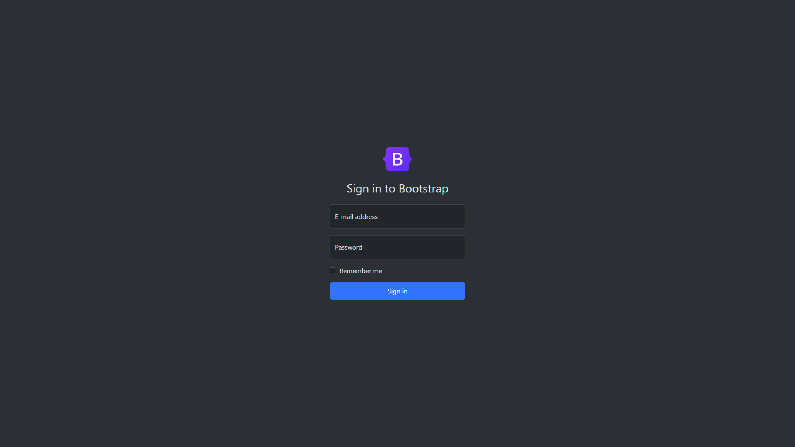

<h1 align="center"> Form Bootstrap </h1>

Formulário simples de login, criado com classes do Bootstrap.

  <a href="#-tecnologias">Tecnologias</a>&nbsp;&nbsp;&nbsp;|&nbsp;&nbsp;&nbsp;
  <a href="#-projeto">Projeto</a>&nbsp;&nbsp;&nbsp;|&nbsp;&nbsp;&nbsp;
  <a href="#memo-licença">Licença</a>

  

 

  

## 🚀 Tecnologias

Esse projeto foi desenvolvido com as seguintes tecnologias:

- HTML e CSS
- Bootstrap
- Git e Github

## 💻 Projeto

O formulário foi criado apenas para colocar em prática conhecimentos adiquiridos em estudos.

## :memo: Licença

Esse projeto está sob a licença MIT.

---

Feito por Marcos